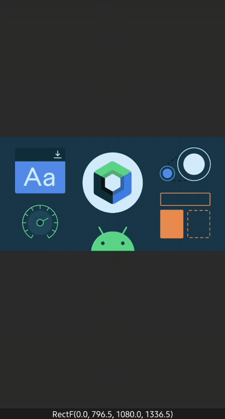

<h1 align="center">PhotoView</h1></br>

<p align="center">
🌇 PhotoView is an ImageView component for Android that enables zoom functionality through diverse touch gestures. This project has been forked from ChrisBanes' PhotoView.
</p>

> The aim of this library is to sync up to the recent androidx library, address bugs, enhance features, and distribute the package through Maven Central instead of Jitpack.

</br>
<p align="center">
  <a href="https://opensource.org/licenses/Apache-2.0"></a>
  <a href="https://android-arsenal.com/api?level=21"></a>
  <a href="https://github.com/GetStream/photoview-android/actions/workflows/android.yml"></a>
  <a href="https://getstream.io"></a>
</p><br>

<p align="center">


</p>

## Download
[](https://central.sonatype.com/artifact/io.getstream/photoview)

### Gradle

Add the dependency below to your **module**'s `build.gradle` file:

```gradle
dependencies {
    implementation("io.getstream:photoview:1.0.0")
}
```

## Usage

`PhotoView` can be utilized exactly like `ImageView`, as demonstrated in the example below:

```xml
<io.getstream.photoview.PhotoView
    android:id="@+id/phptoView"
    android:layout_width="match_parent"
    android:layout_height="match_parent"
    android:src="@drawable/wallpaper"/>
```

When incorporating third-party image loading libraries like Glide or Coil, images can be loaded as demonstrated in the following examples.

### Coil

```kotlin
val photoView = binding.photoView
photoView.load(IMAGE_URL) {
  crossfade(true)
}
```

### Glide

```kotlin
val photoView = binding.photoView
Glide.with(this)
  .load(IMAGE_URL)
  .into(photoView)
```

Exploring the [sample](https://github.com/GetStream/photoview-android/tree/main/sample) directory reveals a variety of practical examples, including integration with ViewPager, using PhotoView with shared transition elements, utilizing third-party image libraries (such as Coil, Glide, and Picasso), among others.

## Supported Features

- **Effortless Zooming**: Enables zooming capabilities through multi-touch gestures and double-tapping.
- **Smooth Scrolling**: Offers seamless scrolling experience with fluid fling motion.
- **Compatibility with Scrolling Parents**: Integrates flawlessly within scrolling containers, like ViewPager, ensuring smooth operation.
- **Matrix Change Notifications**: Alerts the application when the displayed Matrix changes, which is essential for UI adjustments based on the current zoom or scroll position.
- **User Tap Notifications**: Notifies the application when the user interacts with the Photo, facilitating responsive UI actions.

## Find this repository useful? :heart:
Support it by joining __[stargazers](https://github.com/skydoves/FlexibleBottomSheet/stargazers)__ for this repository. :star: <br>
Also, __[follow me](https://github.com/skydoves)__ on GitHub for my next creations! 🤩

# License
```xml
Copyright 2024 Stream.IO, Inc.
Copyright 2011, 2012 Chris Banes.

Licensed under the Apache License, Version 2.0 (the "License");
you may not use this file except in compliance with the License.
You may obtain a copy of the License at

   http://www.apache.org/licenses/LICENSE-2.0

Unless required by applicable law or agreed to in writing, software
distributed under the License is distributed on an "AS IS" BASIS,
WITHOUT WARRANTIES OR CONDITIONS OF ANY KIND, either express or implied.
See the License for the specific language governing permissions and
limitations under the License.
```
